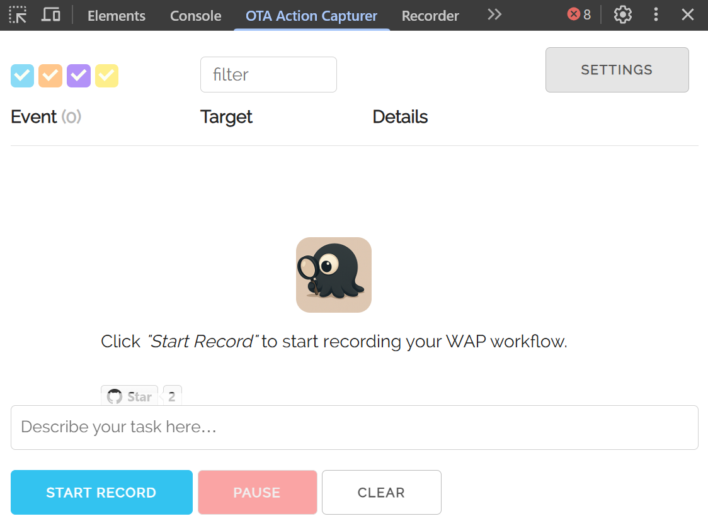
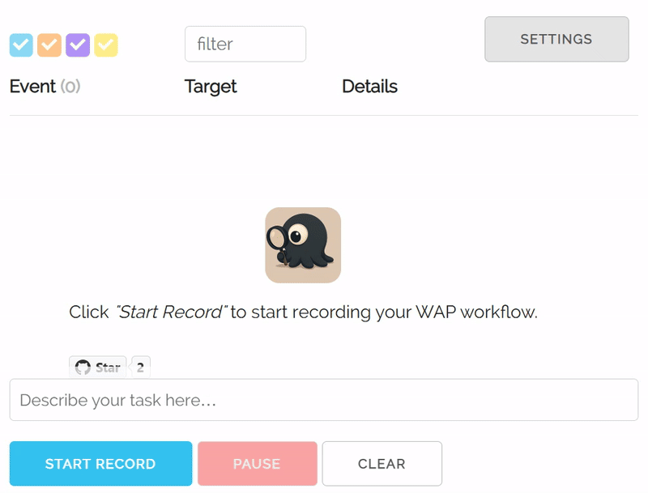
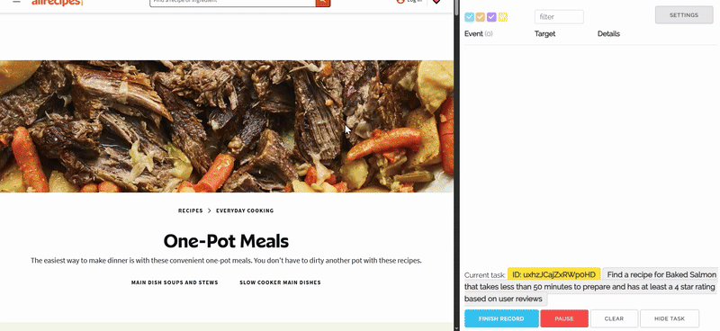
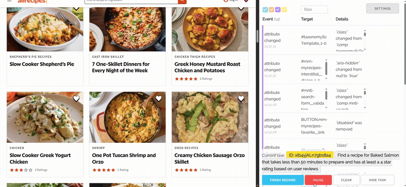

<!-- markdownlint-disable first-line-h1 -->
<!-- markdownlint-disable html -->
<!-- markdownlint-disable no-duplicate-header -->

<div align="center">
  
</div>
<br>
<div align="center" style="line-height: 1;">
  <a href="https://www.otatech.ai/"></a>
  <a href="https://huggingface.co/OTA-AI/OTA-v1"></a>
  <a href="https://github.com/OTA-Tech-AI/webagentprotocol/tree/main/chrome-extension/LICENSE"></a>
  <br><br><br>
</div>


OTA WAP Browser Action Capturer
======================

OTA browser action capturer is a simple tool which helps you to collect the interactions with browser such as click, typing etc. and transforms them to well structured data for generating LLM-powered "records and replay" instructions. The action data will be organized in a JSON format and sent to your local WAP server of data collection.

To deploy the local WAP server, please refer to: 
WAP (Web Agent protocol) is our standard protocol for AI Agent record-and-play inferencing.


Installation
-----

TBD

Usage of Action Capturer
-----

### Perpare

Open Chrome DevTools and navigate to the **"OTA Action Capturer"** panel and you will see:



Make sure the IP address and port in Settings are correct:


### Start a record

Clearly describe the task you will be working on and click "START RECORD":



The capturer will record actions such as clicking, typing, navigating etc. only in the current page.

If the HTML content in the page changed, the event table will present the added/removed/changed nodes. The information of changing will be collected and sent to your local WAP server.



An example of the formatted data which you will received in the WAP backend server is like:

```json
{
  "taskId": "MkCAhQsHgXn7YgaK",
  "type": "click",
  "actionTimestamp": 1746325231479,
  "eventTarget": {
    "type": "click",
    "target": "<a ota-use-interactive-target=\"1\" data-ordinal=\"3\" href=\"https://www.allrecipes.com/recipe/68925/cheesy-baked-salmon/\" data-tax-levels=\"\" data-doc-id=\"6592066\" class=\"comp mntl-card-list-card--extendable mntl-universal-card mntl-document-card mntl-card card card--no-image\" id=\"mntl-card-list-card--extendable_3-0\">\n<div class=\"loc card__top\"><div class=\"card__media mntl-image card__media universal-image__container\">...",
    "targetId": "mntl-card-list-card--extendable_3-0",
    "targetClass": "comp mntl-card-list-card--extendable mntl-universal-card mntl-document-card mntl-card card card--no-image"
  },
  "allEvents": {},
  "pageHTMLContent": "<header data-tracking-container=\"true\" data-collapsible=\"true\" class=\"comp header mntl-header mntl-header--magazine mntl-header--open-search-bar mntl-header--myr\" id=\"header_1-0\"><a data-tracking-container=\"true\" id=\"mntl-skip-to-content_1-0\" class=\"mntl-skip-to-content mntl-text-link\" rel=\"nocaes\" href=\"#main\"></a><div class=\"mntl-header__menu-top\">..."
}
```

The extension utilized MutationObserver to capture any node changes in the page, please refer to [MutationObserver](https://developer.mozilla.org/en/docs/Web/API/MutationObserver) for more details.

### Pause
During the record, you can click on "PAUSE" to pause the capturer so that no actions will be recorded until you hit "RESUME":



Thanks to
------

OTA action capturer is built on top of [DOMListenerExtension](https://github.com/kdzwinel/DOMListenerExtension).

License
-------

This program is free software: you can redistribute it and/or modify
it under the terms of the GNU General Public License as published by
the Free Software Foundation, either version 3 of the License, or
(at your option) any later version.

This program is distributed in the hope that it will be useful,
but WITHOUT ANY WARRANTY; without even the implied warranty of
MERCHANTABILITY or FITNESS FOR A PARTICULAR PURPOSE.  See the
GNU General Public License for more details.

You should have received a copy of the GNU General Public License
along with this program.  If not, see <http://www.gnu.org/licenses/>.
